# imlplots: interpretable machine learning plots
`imlplots ` is an R package that provides an interactive Shiny dashboard for three kinds of Interpretable Machine Learning (IML) plots
 
* Partial Dependence Plots (PDP)
* Individual Conditional Expectation (ICE) plots
* Accumulated Local Effect (ALE) plots

```{r global_options, include=FALSE}
library(knitr)
opts_chunk$set(echo=TRUE, warning=FALSE, message=FALSE)
set.seed(42)
load("../data/boston.rda")
load("../data/fire.rda")
load("../data/titanic.rda")
library(mlr)
library(png)
library(grid)
```

# Installation 
The package can be installed directly from github with devtools
```{r iml package, eval=TRUE, results='hide'}
# install.packages("devtools")
devtools::install_github('juliafried/imlplots')
library(imlplots)
```

# Quickstart
You can fit classification and regression problems from the `mlr` package and analyse possible interaction effects in a Shiny dasbhoard.

For quickstart we take the popular Boston Housing data, where we want to predict the median housing price in Boston.
```{r}
print(summarizeColumns(boston)[, -c(5, 6, 7)], digits = 4)
```

For using `imlplots` Shiny dashboard, three input arguments need to be specified

* `data` - the input data
* `task`- the learning task
* `models` - one or several trained models

We create a regression task with `medv` as target variable.
The task structure is determined by `mlr` package.
```{r}
boston.task = makeRegrTask(data = boston, target = "medv")
```

The `imlplots` dashboard allows the comparison of multiple learning algorithms, therefore we fit two different models - first a random forest and second a GLM.
```{r}
rf.mod = train("regr.randomForest", boston.task)
glm.mod = train("regr.glm", boston.task)
```

The input for the Shiny app is a list of learners.
```{r}
mod.list = list(rf.mod, glm.mod)
```

Now the Shiny app can be used.
```{r, eval=FALSE}
imlplots(data = boston, task = boston.task, models = mod.list)
```

## Code for Copy & Paste
```{r, eval=FALSE}
boston.task = makeRegrTask(data = boston, target = "medv")

rf.mod = train("regr.randomForest", boston.task)
glm.mod = train("regr.glm", boston.task)
mod.list = list(rf.mod, glm.mod)

imlplots(data = boston, task = boston.task, models = mod.list)
```


# Further Examples

## IML Plots for Regression Tasks
To show how you can use the `imlplots` Shiny app for regression tasks we use fire data, where the burned area of forests due to fires should be analyzed. 

```{r head fire}
print(summarizeColumns(fire)[, -c(5, 6, 7)], digits = 4)
```

The target variable is `area`, which is between 0.00 and 1090.84 ha.
```{r summary fire}
summary(fire$area)
```

We create a regression task with target variable `area`.
```{r task fire}
fire.task = makeRegrTask(data = fire, target = "area")
```

Next we train several `mlr` models and save them in a list of models.
Note: The order in your model list will determine the model order in the Shiny dashboard.

```{r models fire}
fire.rf = train("regr.randomForest", fire.task)
fire.glm = train("regr.glm", fire.task)
fire.lm = train("regr.lm", fire.task)

mod.list = list(fire.rf, fire.glm, fire.lm)
```

No we can open the `imlplots` Shiny app.
```{r imlplots fire, eval=FALSE}
imlplots(data = fire, task = fire.task, models = mod.list)
```

The Shiny dashboard contains four tabs

* Data
* Settings
* Plots
* Learner Summary

### Data
The `Data` tab shows your input data. This data is taken to generate IML plots.
If you want to check how changes in the data effect your plot, you can simply filter in the `Data` tab.

```{r echo=FALSE, out.width='100%'}
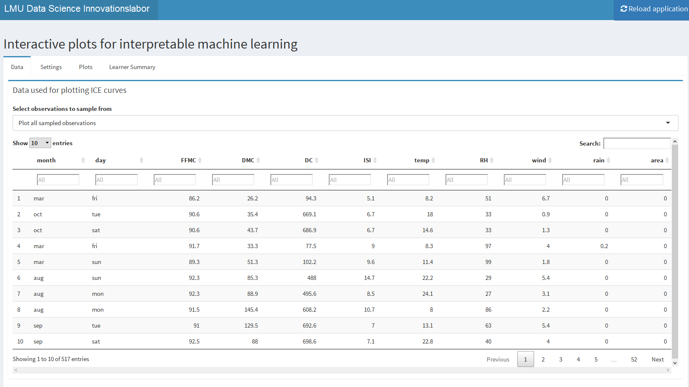
```

For filtering two options are given

1. `Plot all sampled observations`: In this setting you can filter via the filters beneath the column titles and all rows will be used for plotting.
2. `Plot indiviudal observations`: In this setting after using the filters, you have to manually select specific rows.

### Settings
The next tab `Settings` contains all possible plot settings and the selected IML plot.

```{r echo=FALSE, out.width='100%'}
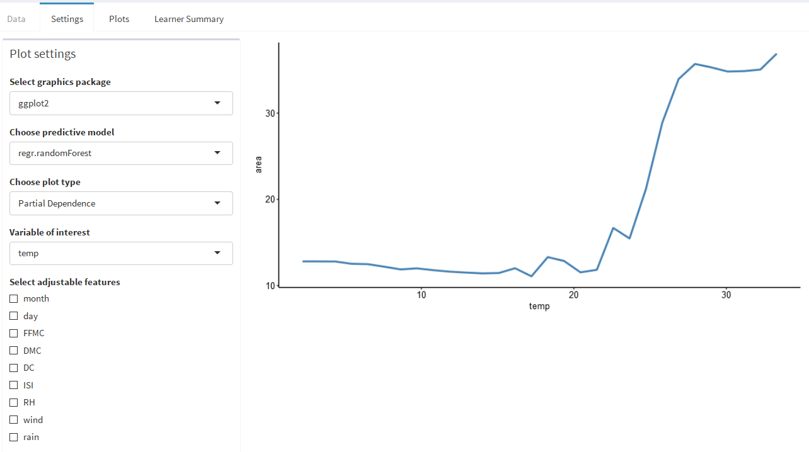
```

There are various settings

1. `Select graphics package`: You can select the graphics package - we offer `ggplot2` and `plotly`. Use `ggplot2` if your computer is not the fastest one.
2. `Choose predictive model`: Choose one of your fitted models. The order in the dropdown is the order of your list.
3. `Choose plot type`: We offer PDP, ICE and ALE plots
If you select ICE plot, you will get a new selection field. Possible are `centered` and `regular` ICE plots
4. `Variable of interest`: This dropdown will determine the x-axis of your plot and will determine the effect that is plotted 

##### PDP
On the right side of the dashboard page, the selected plot is shown.

To check out effects, you can turn on `Select adjustable features`. This option allows you to set one of the variables to a specifc value.

```{r echo=FALSE, out.width='100%'}
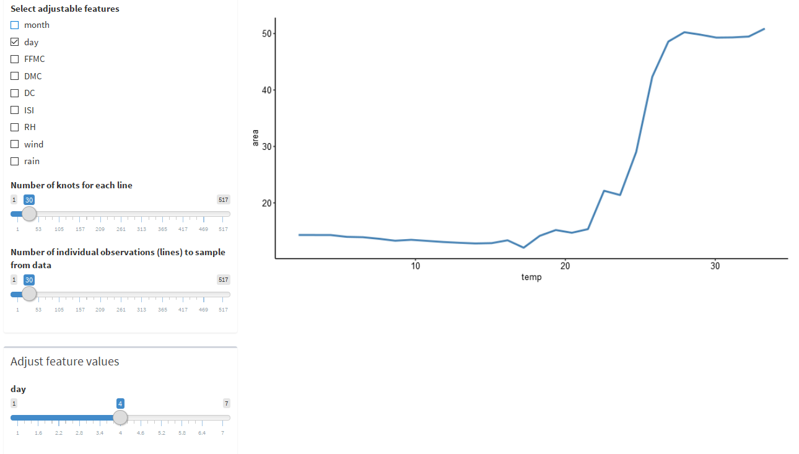
```

It is also possible to change the number of knots and lines (individual observations) with the shown sliders.

##### ICE Plot
The ICE plot contains all sampled, individual observations in blue. The red line is from PDP.

```{r echo=FALSE, out.width='100%'}
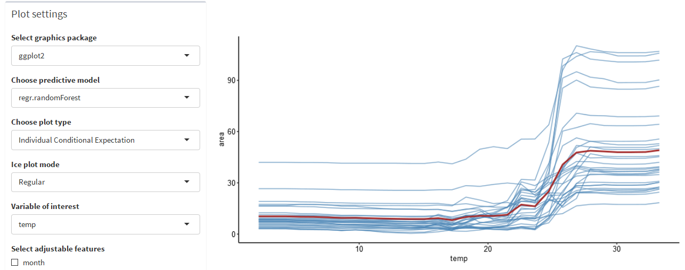
```

As described above, you can select between `Regular` and `Centered` ICE plots.

```{r echo=FALSE, out.width='100%'}
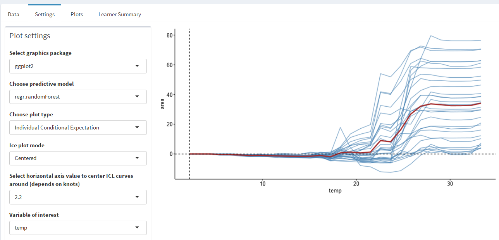
```

##### ALE Plot
The ALE plot can be selected, too.
Please keep in mind, that the ALE plot has a different y-axis than the PDP and ICE plot.

```{r echo=FALSE, out.width='100%'}
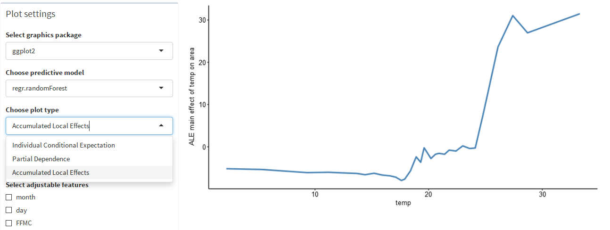
```

For ALE plots you can swith between two `ALE Plot Modes`. The `Main Effets` mode allows you to select one variable of interest and shows its interaction effect.
The `Second Order Effects` setting allows to select another `ALE interaction variable` and therefore shows the effect for this extra variable too.
If you select `plotly` as graphics package, the second order effects ALE plot will be a 3D plot.

```{r echo=FALSE, out.width='100%'}
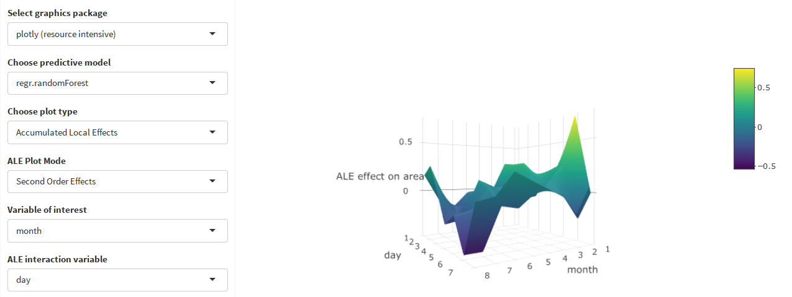
```

### Plots
The third tab `Plots` shows the selected IML plot in full screen via the sub-tab `Zoomed plot`.
The sub-tab `Scatterplot` shows the filtered and unfiltered scatterplot between the `variable of interest` and the `target` variable of the model.

In the `Data` tab we filtered for a high value of burned area and selected three individual observations.

```{r echo=FALSE, out.width='80%'}
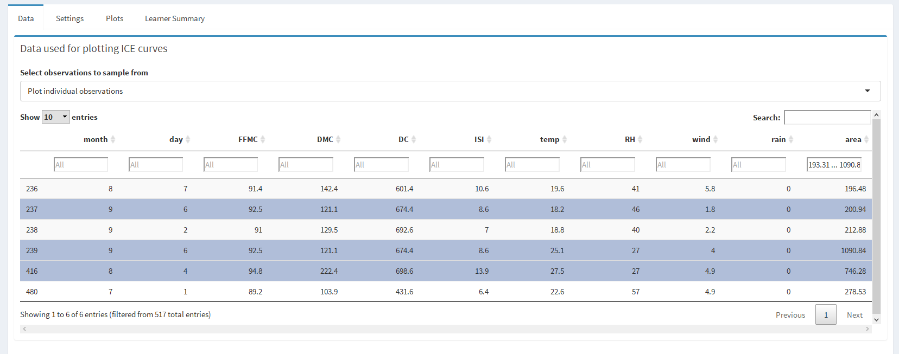
```

The filtered data scatterplot shows the selected high area values and also the three individual observations (in red).

```{r echo=FALSE, out.width='80%'}
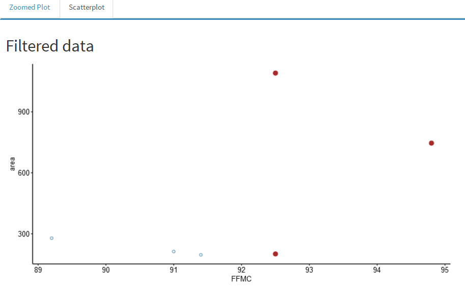
```

The unfiltered data scatterplot shows all data points and also the three individual observations (in red).

### Learner Summary
The fourth tab `Learner Summary` shows the currently selected learner summary. If you want to see another summary, you have to select another model in the `Settings` tab.

```{r echo=FALSE, out.width='100%'}
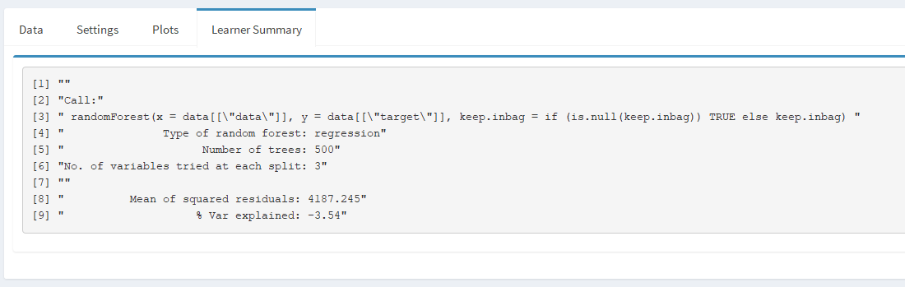
```

### Code for Copy & Paste
```{r, eval=FALSE}
library(imlplots)

fire.rf = train("regr.randomForest", fire.task)
fire.glm = train("regr.glm", fire.task)
fire.lm = train("regr.lm", fire.task)

mod.list = list(fire.rf, fire.glm, fire.lm)

imlplots(data = fire, task = fire.task, models = mod.list)
```

## IML Plots for Classification Tasks

For the classification example only the differences to the regression example will be explained.
We use the titanic data set, where the aim is to predict the survival chance.

```{r}
print(summarizeColumns(titanic)[, -c(5, 6, 7)], digits = 4)
```

Again we create a task and fit a model. 

```{r}
library(imlplots)

titanic.task = makeClassifTask(data = titanic, target = "Survived")
titanic.rf = train("classif.randomForest", titanic.task)
```

Next we open the Shiny dashboard.

```{r, eval=FALSE}
imlplots(data = titanic, task = titanic.task, titanic.rf)
```

This time it is useful to select `plotly` in the `Select graphics package` dropdown.

```{r echo=FALSE, out.width='100%'}
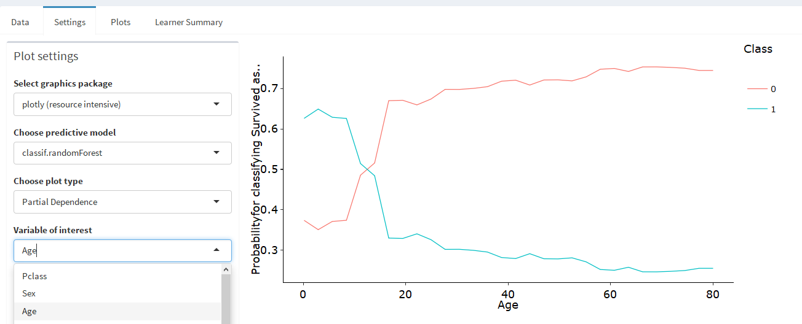
```

This allows you to deselect single classes to increase the visability of individual lines, which is very useful for ICE plot.

```{r echo=FALSE, out.width='80%'}
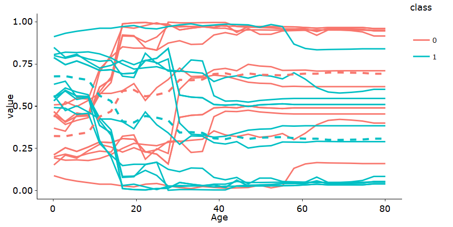
```

```{r echo=FALSE, out.width='80%'}
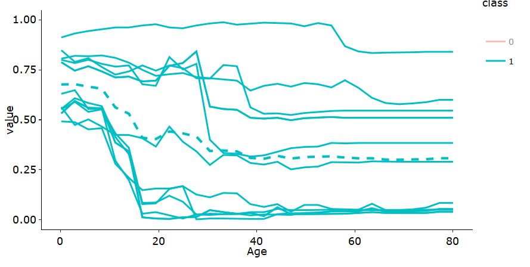
```

### Code for Copy & Paste
```{r, eval=FALSE}
library(imlplots)

titanic.task = makeClassifTask(data = titanic, target = "Survived")
titanic.rf = train("classif.randomForest", titanic.task)

imlplots(data = titanic, task = titanic.task, titanic.rf)
```

# References

* [References](https://github.com/juliafried/imlplots/raw/master/paper/references.pdf)
